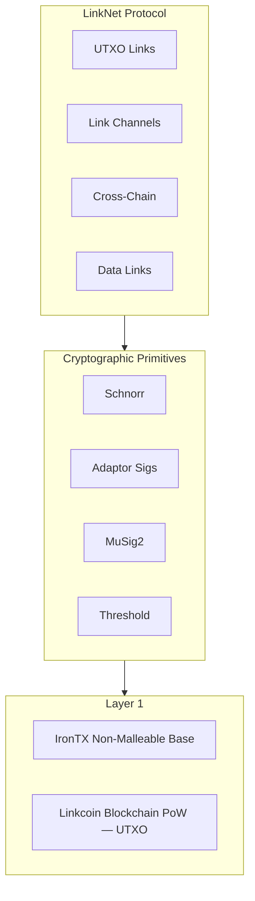

# The Linkcoin Solution

## 3.1 Architecture Overview

Linkcoin introduces LinkNet: a unified protocol layer for linking value, data, and identity.

## 3.2 The Linking Thesis

Every valuable action in the blockchain economy involves linking:

| Action | What’s Being Linked |
| :--- | :--- |
| **Payment** | Sender → Receiver |
| **Smart Contract** | Conditions → Outcomes |
| **Identity** | Person → Public Key |
| **Atomic Swap** | Chain A TX → Chain B TX |

Linkcoin makes linking a first-class primitive.
